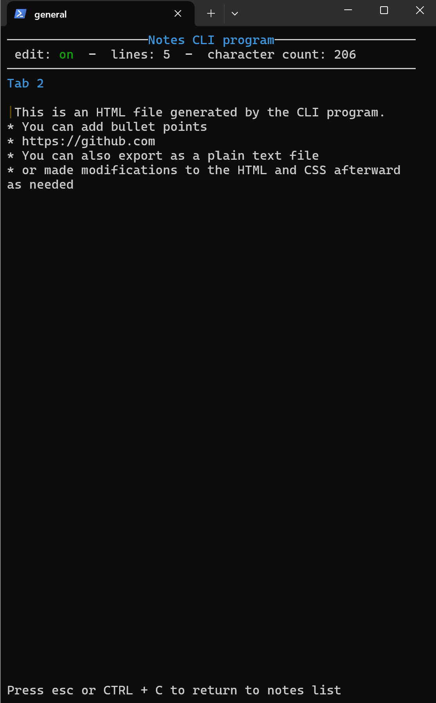
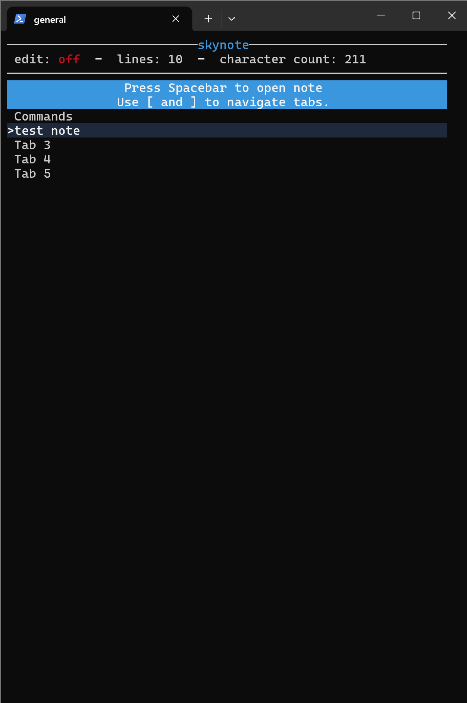
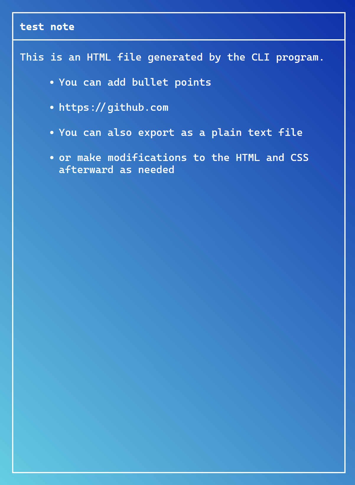

# skynote

A note-taking tool that formats notes as .html or .txt files.
Built with the ratatui Rust crate.\
I made this to create nicely formatted notes to share with others on a personal website.

## Features

- Creates tabs for multiple notes
- Export to .html (styled & plain) and .txt files
- The user can then modify, restyle, upload, etc. the .html file as needed
- Formats `
` and `<ul>` HTML elements for notes containing both paragraphs and lists

## Commands

| Command         | Result               |
| --------------- | -------------------- |
| [ ], Left/Right | Switch tab           |
| Ctrl + E        | Change edit mode     |
| Ctrl + S        | Export or save       |
| Ctrl + O        | Open HTML file       |
| Ctrl + R        | Rename tab/file name |
| Spacebar        | Open note            |
| q               | Close popup          |
| Esc, Ctrl + C   | Exit program         |

## Installation

1. On Windows:

   - Download [the .exe file](https://github.com/ollime/cli-program/raw/main/skynote.exe). After downloading, double-click on the file in file explorer

2. From source:
   - `git clone https://github.com/ollime/cli-program`
   - To run the project: `cargo run`
   - To build the project: `cargo build`

Make sure there is a `data/` folder where the project is being run.
