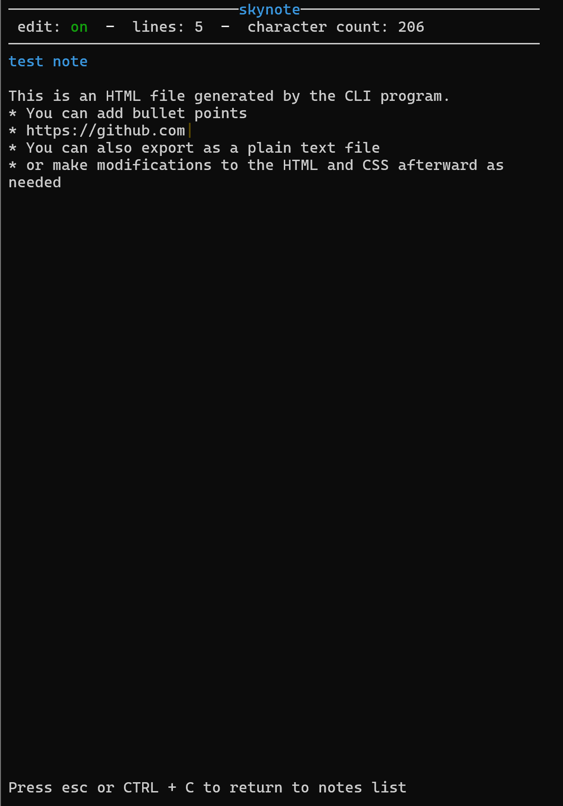

# Notes CLI program

- Creates tabs for multiple notes
- Export to .html (styled & plain) and .txt files
- The user can then modify, restyle, upload, etc. the .html file as needed
- Formats `
` and `<ul>` HTML elements for notes containing both paragraphs and lists

## Commands

| Command         | Result               |
| --------------- | -------------------- |
| [ ], Left/Right | Switch tab           |
| Ctrl + E        | Change edit mode     |
| Ctrl + S        | Export or save       |
| Ctrl + O        | Open HTML file       |
| Ctrl + R        | Rename tab/file name |
| Spacebar        | Open note            |
| q               | Close popup          |
| Esc, Ctrl + C   | Exit program         |

## Download

- Download the .exe file here
- Run the .exe file in a terminal: `command`

Make sure there is a `data/` folder where the .exe file is being run.
